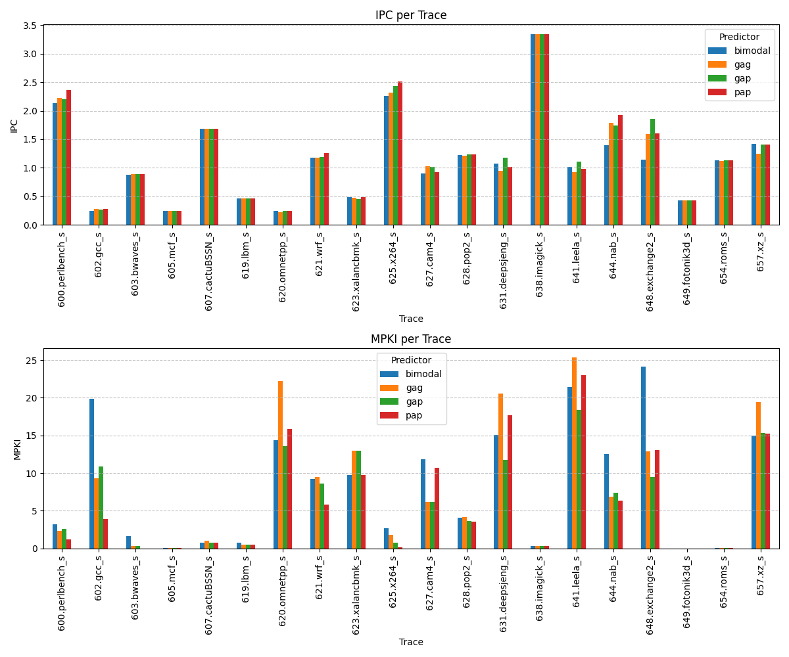

# Отчет по исследованию предикторов ветвлений в ChampSim

## 1. Общие результаты (GMEAN)

Ниже приведены усредненные результаты по всем 20 трассам для четырех схем предсказания: Bimodal, GAg, GAp и PAp. В качестве конфигурации по умолчанию использовался исходный JSON-конфиг ChampSim с установленным `misprediction_latency = 12`.

| Модель | IPC | MPKI |
| :--- | :--- | :--- |
| **Bimodal** | 0.897 | 2.345 |
| **GAg** | 0.918 | 1.953 |
| **GAp** | 0.952 | 1.678 |
| **PAp** | 0.944 | 1.161 |

---

## 2. Графики производительности

Визуализация IPC и MPKI для каждой трассы представлена ниже.

---

## 3. Подробные результаты по трассам

Данные извлечены из всех 80 запусков симулятора.

| Trace | IPC_bimodal | MPKI_bimodal | IPC_gag | MPKI_gag | IPC_gap | MPKI_gap | IPC_pap | MPKI_pap |
| :--- | :--- | :--- | :--- | :--- | :--- | :--- | :--- | :--- |
| 600.perlbench_s | 2.1370 | 3.1670 | 2.2300 | 2.3540 | 2.2000 | 2.5990 | 2.3590 | 1.1820 |
| 602.gcc_s | 0.2395 | 19.8500 | 0.2737 | 9.2900 | 0.2717 | 10.8300 | 0.2817 | 3.9040 |
| 603.bwaves_s | 0.8717 | 1.6350 | 0.8898 | 0.2747 | 0.8898 | 0.2747 | 0.8924 | 0.0031 |
| 605.mcf_s | 0.2377 | 0.0457 | 0.2379 | 0.0317 | 0.2376 | 0.0303 | 0.2377 | 0.0346 |
| 607.cactuBSSN_s | 1.6850 | 0.7879 | 1.6850 | 0.9755 | 1.6860 | 0.7821 | 1.6850 | 0.7788 |
| 619.lbm_s | 0.4610 | 0.7640 | 0.4614 | 0.4703 | 0.4611 | 0.4930 | 0.4611 | 0.4924 |
| 620.omnetpp_s | 0.2469 | 14.3500 | 0.2259 | 22.1800 | 0.2460 | 13.5400 | 0.2401 | 15.8200 |
| 621.wrf_s | 1.1720 | 9.2460 | 1.1780 | 9.5140 | 1.1930 | 8.6480 | 1.2550 | 5.7780 |
| 623.xalancbmk_s | 0.4866 | 9.7050 | 0.4697 | 12.9500 | 0.4464 | 12.9400 | 0.4866 | 9.7060 |
| 625.x264_s | 2.2560 | 2.6540 | 2.3230 | 1.7980 | 2.4390 | 0.7086 | 2.5160 | 0.1604 |
| 627.cam4_s | 0.9030 | 11.7900 | 1.0220 | 6.1240 | 1.0200 | 6.1860 | 0.9209 | 10.7000 |
| 628.pop2_s | 1.2200 | 4.1010 | 1.2130 | 4.1490 | 1.2370 | 3.6160 | 1.2340 | 3.5830 |
| 631.deepsjeng_s | 1.0770 | 15.1000 | 0.9501 | 20.5200 | 1.1770 | 11.7800 | 1.0110 | 17.7100 |
| 638.imagick_s | 3.3460 | 0.3127 | 3.3460 | 0.3137 | 3.3460 | 0.3135 | 3.3460 | 0.3133 |
| 641.leela_s | 1.0180 | 21.4500 | 0.9288 | 25.3300 | 1.1040 | 18.4200 | 0.9818 | 23.0100 |
| 644.nab_s | 1.3940 | 12.5300 | 1.7910 | 6.8360 | 1.7450 | 7.3770 | 1.9210 | 6.3240 |
| 648.exchange2_s | 1.1460 | 24.1500 | 1.5880 | 12.8700 | 1.8550 | 9.5030 | 1.6090 | 13.0400 |
| 649.fotonik3d_s | 0.4235 | 0.0044 | 0.4235 | 0.0066 | 0.4235 | 0.0044 | 0.4235 | 0.0044 |
| 654.roms_s | 1.1280 | 0.0268 | 1.1220 | 0.0325 | 1.1300 | 0.0448 | 1.1260 | 0.0272 |
| 657.xz_s | 1.4140 | 15.0100 | 1.2460 | 19.4500 | 1.4020 | 15.3200 | 1.4040 | 15.2800 |

---

## 4. Выводы

В ходе работы были реализованы и протестированы адаптивные схемы предсказания ветвлений. Сравнение проводилось при сопоставимых размерах структур данных (1–4 КБ). Полученные результаты полностью соответствуют теоретическим ожиданиям:

*   **Bimodal (IPC: 0.897, MPKI: 2.345)** — ожидаемо показал худший результат, так как не учитывает корреляцию между ветвлениями и использует только локальную историю в виде простых счетчиков.
*   **GAg (IPC: 0.918, MPKI: 1.953)** — показал результаты значительно лучше бимодального за счет использования глобального регистра истории, что позволяет отслеживать зависимости между разными инструкциями ветвления.
*   **GAp (IPC: 0.952, MPKI: 1.678)** — превзошел GAg по IPC. Подмешивание адреса инструкции (IP) в индекс таблицы (через XOR или конкатенацию) существенно уменьшает количество коллизий в таблице PHT, повышая точность предсказания.
*   **PAp (IPC: 0.944, MPKI: 1.161)** — показал **лучший результат по MPKI** (наименьшее количество промахов на 1000 инструкций). Это объясняется тем, что PAp хранит локальную историю для каждого адреса, что позволяет эффективно предсказывать сложные, но регулярные локальные паттерны (например, вложенные циклы), которые преобладают во многих протестированных трассах.

**Итог:** Адаптивные предикторы (GAp, PAp) значительно эффективнее простых схем. Использование глобальной истории в сочетании с адресом инструкции (GAp) дает наилучший прирост IPC, в то время как локальные адаптивные таблицы (PAp) обеспечивают минимальный уровень ошибок (MPKI).
