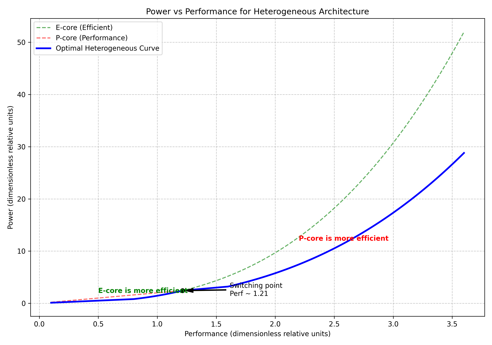

# Отчет по заданию 1: Гетерогенная архитектура

## 1. Постановка задачи
Рассматривается гетерогенный процессор с двумя типами ядер:
*   **Performance (P-core):** $IPC_P = 2 \times IPC_E$, $C_{dyn,P} = 4 \times C_{dyn,E}$.
*   **Efficient (E-core):** Базовые значения $IPC_E = 1$, $C_{dyn,E} = 1$.

### Зависимость напряжения от частоты
Напряжение $U$ зависит от частоты $f$ следующим образом:
*   $U_{min} = 1$.
*   При $f = 1$, $U = 1.2$.
*   При $f = 1.8$, $U = 2$.

Линейная аппроксимация $U(f) = f + 0.2$ при условии $U \ge U_{min}$ дает:
$$U(f) = \max(1, f + 0.2)$$

### Основные формулы
*   **Performance:** $Perf = IPC \times f \implies f = \frac{Perf}{IPC}$.
*   **Power:** $P = C_{dyn} \times U^2 \times f$.

## 2. Анализ зависимостей Power(Performance)

### E-core
*   $f_E = Perf$
*   $U_E = \max(1, Perf + 0.2)$
*   $P_E = 1 \times U_E^2 \times Perf$

### P-core
*   $f_P = \frac{Perf}{2}$
*   $U_P = \max(1, \frac{Perf}{2} + 0.2)$
*   $P_P = 4 \times U_P^2 \times \frac{Perf}{2} = 2 \times U_P^2 \times Perf$

### Точка пересечения
При низких значениях производительности ($Perf < 0.8$) оба ядра работают при $U = 1$:
*   $P_E = Perf$
*   $P_P = 2 \times Perf$
Здесь E-ядро эффективнее.

При росте $Perf$, E-ядро начинает повышать напряжение ($U_E = Perf + 0.2$), в то время как P-ядро все еще может работать на $U = 1$ (так как его частота в 2 раза ниже).
Пересечение происходит, когда $P_E = P_P$:
$$(Perf + 0.2)^2 \times Perf = 2 \times 1^2 \times Perf$$
$$(Perf + 0.2)^2 = 2 \implies Perf = \sqrt{2} - 0.2 \approx 1.21$$

## 3. Результаты
На графике ниже представлены зависимости мощности от производительности для обоих ядер, а также оптимальная кривая (минимум энергопотребления для заданной производительности).

### Выводы
1.  **E-core** является более эффективным при низкой производительности (до $Perf \approx 1.21$).
2.  **P-core** становится выгоднее при высоких требованиях к производительности, так как позволяет достичь той же частоты выполнения инструкций при меньшей тактовой частоте ядра, что позволяет дольше сохранять низкое рабочее напряжение.
3.  Оптимальная стратегия исполнения заключается в переключении с E-ядра на P-ядро в точке пересечения их мощностных характеристик.
