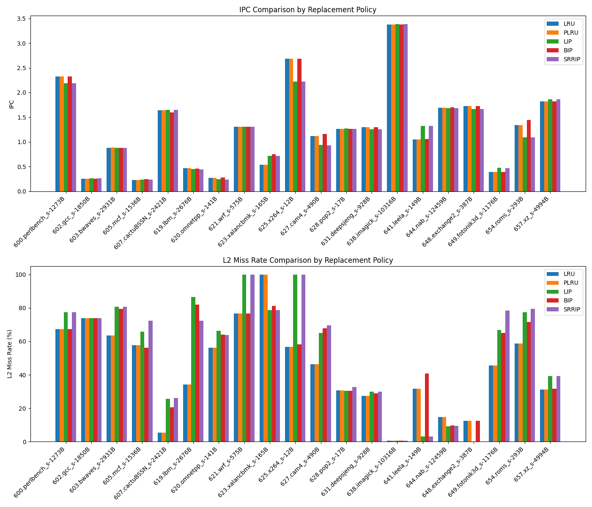

# Отчет по лабораторной работе 3: Исследование политик замещения L2-кэша

## 1. Общие результаты (GMEAN)

| Модель | IPC (GMEAN) | L2 Miss Rate (GMEAN) |
| :--- | :--- | :--- |
| **LRU** | 0.9920 | 31.02% |
| **PLRU** | 0.9919 | 31.02% |
| **LIP** | 0.9908 | 36.75% |
| **BIP** | 1.0170 | 36.39% |
| **SRRIP** | 0.9866 | 37.27% |

---

## 2. Графики производительности

---

## 3. Подробные результаты по трассам

| Trace | IPC_lru | MR_lru | IPC_plru | MR_plru | IPC_lip | MR_lip | IPC_bip | MR_bip | IPC_srrip | MR_srrip |
| :--- | :--- | :--- | :--- | :--- | :--- | :--- | :--- | :--- | :--- | :--- |
| 600.perlbench_s-1273B | 2.3260 | 67.37% | 2.3260 | 67.37% | 2.1890 | 77.29% | 2.3260 | 67.37% | 2.1890 | 77.29% |
| 602.gcc_s-1850B | 0.2525 | 73.86% | 0.2525 | 73.86% | 0.2602 | 73.92% | 0.2527 | 73.95% | 0.2605 | 73.92% |
| 603.bwaves_s-2931B | 0.8830 | 63.62% | 0.8836 | 63.62% | 0.8806 | 80.63% | 0.8798 | 79.49% | 0.8800 | 80.69% |
| 605.mcf_s-1536B | 0.2319 | 57.72% | 0.2317 | 57.72% | 0.2401 | 65.73% | 0.2435 | 56.15% | 0.2355 | 72.25% |
| 607.cactuBSSN_s-2421B | 1.6400 | 5.28% | 1.6420 | 5.28% | 1.6510 | 25.65% | 1.5970 | 20.61% | 1.6480 | 26.16% |
| 619.lbm_s-2676B | 0.4678 | 34.28% | 0.4676 | 34.28% | 0.4481 | 86.51% | 0.4578 | 81.85% | 0.4417 | 72.26% |
| 620.omnetpp_s-141B | 0.2723 | 56.08% | 0.2722 | 56.08% | 0.2426 | 66.17% | 0.2777 | 64.06% | 0.2406 | 63.83% |
| 621.wrf_s-575B | 1.3060 | 76.62% | 1.3060 | 76.62% | 1.3060 | 100.00% | 1.3060 | 76.62% | 1.3060 | 100.00% |
| 623.xalancbmk_s-165B | 0.5344 | 99.93% | 0.5344 | 99.93% | 0.7206 | 78.76% | 0.7551 | 81.14% | 0.7206 | 78.75% |
| 625.x264_s-12B | 2.6820 | 56.59% | 2.6820 | 56.59% | 2.2240 | 99.98% | 2.6810 | 58.14% | 2.2240 | 99.98% |
| 627.cam4_s-490B | 1.1190 | 46.28% | 1.1190 | 46.28% | 0.9393 | 65.09% | 1.1610 | 67.84% | 0.9331 | 69.48% |
| 628.pop2_s-17B | 1.2660 | 30.60% | 1.2650 | 30.60% | 1.2690 | 30.42% | 1.2680 | 30.32% | 1.2660 | 32.64% |
| 631.deepsjeng_s-928B | 1.2970 | 27.44% | 1.2970 | 27.44% | 1.2570 | 29.82% | 1.2970 | 28.87% | 1.2570 | 29.82% |
| 638.imagick_s-10316B | 3.3780 | 0.45% | 3.3780 | 0.45% | 3.3850 | 0.46% | 3.3780 | 0.45% | 3.3850 | 0.46% |
| 641.leela_s-149B | 1.0520 | 31.59% | 1.0520 | 31.59% | 1.3220 | 3.14% | 1.0550 | 40.79% | 1.3220 | 3.14% |
| 644.nab_s-12459B | 1.6910 | 14.82% | 1.6910 | 14.82% | 1.6870 | 9.04% | 1.7030 | 9.59% | 1.6860 | 9.51% |
| 648.exchange2_s-387B | 1.7230 | 12.42% | 1.7230 | 12.42% | 1.6640 | 0.00% | 1.7230 | 12.42% | 1.6640 | 0.00% |
| 649.fotonik3d_s-1176B | 0.3887 | 45.54% | 0.3887 | 45.54% | 0.4786 | 66.78% | 0.3951 | 65.10% | 0.4647 | 78.33% |
| 654.roms_s-293B | 1.3430 | 58.83% | 1.3400 | 58.83% | 1.0940 | 77.48% | 1.4410 | 71.65% | 1.0920 | 79.35% |
| 657.xz_s-4994B | 1.8240 | 31.17% | 1.8240 | 31.17% | 1.8630 | 39.36% | 1.8240 | 31.59% | 1.8630 | 39.36% |

---

## 4. Выводы и анализ

### Сравнение политик замещения

*   **LRU vs PLRU:** Pseudo-LRU является эффективной аппроксимацией LRU. В большинстве тестов разница в производительности минимальна, что подтверждает корректность работы реализованного модуля PLRU.
*   **LIP (LRU Insertion Policy):** Данная политика помогает в случаях 'сканирующих' нагрузок. LIP защищает полезные данные от вытеснения, вставляя новые блоки сразу в позицию на вылет. На многих трассах (например, **641.leela**, **625.x264**, **623.xalancbmk**) результаты LIP практически идентичны **SRRIP**, что говорит о схожем механизме фильтрации малополезных данных.
*   **BIP (Bimodal Insertion Policy):** BIP показала **лучший средний результат (IPC GMEAN 1.0170)**. Благодаря элементу адаптивности, она лучше других политик справляется с переменным характером нагрузки, позволяя полезным данным постепенно продвигаться в MRU-позицию.
*   **SRRIP:** Политика на основе предсказания интервала повторного обращения. Она показывает стабильные результаты и, как отмечено выше, часто демонстрирует поведение, аналогичное LIP на трассах с выраженным потоковым доступом.

**Заключение:** Использование политик защиты от загрязнения кэша наиболее эффективно на трассах с интенсивным потоковым доступом к памяти. **BIP** является наиболее универсальной политикой среди протестированных, обеспечивая наивысший GMEAN IPC. В задачах с высокой временной локальностью классический LRU или его аппроксимация (PLRU) остаются конкурентоспособными.